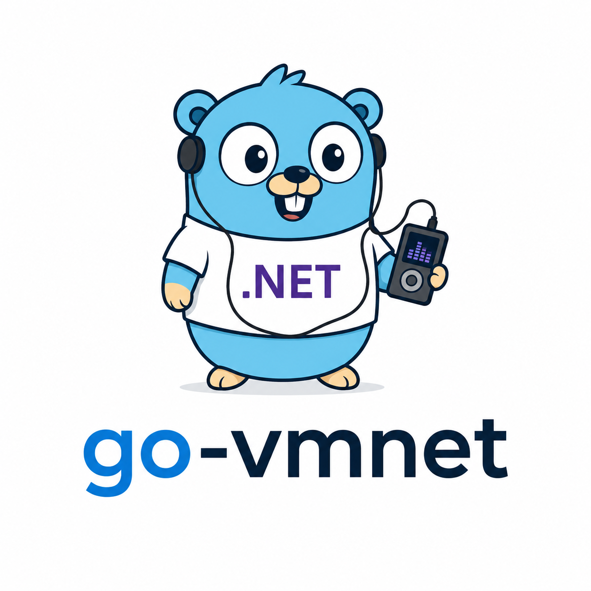

<p align="center">
  
</p>

# vmnet

Un intérprete de IL/CIL puro en Go para correr plugins C# — y un conjunto
creciente de paquetes NuGet reales — dentro de un programa Go, sin
necesidad de tener el runtime de .NET instalado en el host. Alrededor de
ese núcleo intérprete hay cuatro herramientas construidas sobre el mismo
pipeline de ejecución real: un checker de compatibilidad, un analizador de
migración de directorios completos, un generador de código Go, y un SDK de
scaffolding de plugins — ver [CLI y herramientas](#cli-y-herramientas) más
abajo.

**Release actual: [v0.9.0](https://github.com/arturoeanton/go-vmnet/releases/tag/v0.9.0)** — agrega
un `examples/csvhelper-demo` funcionando (el camino real de `AutoMap()` de CsvHelper, basado solo en
reflexión, sin ningún `ClassMap` registrado), el primer acceso de red real y visible desde el host
que tiene este proyecto (`System.Net.Http.HttpClient`/`HttpResponseMessage`/`HttpContent`, protegido
por la capacidad `Permissions.AllowNetwork` ya existente), y un endurecimiento de Jint/Esprima
(clases ES6, grupos de regex reales y clases abreviadas), sobre las herramientas de `v0.8.0` y la API
pública congelada de `v0.7.0` (ver [`docs/en/api-stability.md`](docs/en/api-stability.md) para el
compromiso de semver y [`docs/en/ROADMAP.md`](docs/en/ROADMAP.md) para los commits y tags por Fase
exactos).

**Nota sobre el idioma de la documentación:** desde la Fase 3.82, toda la documentación profunda del
proyecto vive solo en inglés bajo `docs/en/`. Este archivo (`README.es.md`) es la única excepción —
una página de aterrizaje en español mantenida en sincronía con el contenido de `README.md` — para
que quien prefiera español tenga un punto de entrada, sin duplicar el mantenimiento de docenas de
páginas técnicas en dos idiomas.

## Esto corre un motor de JavaScript real. Dentro de un binario Go. Sin CGo.

```go
vm := vmnet.New()
vm.NuGet().Add("Jint", "3.1.3")
vm.NuGet().Restore()
jintAsm, _ := vm.LoadPackage("Jint")

engine, _ := jintAsm.New("Jint.Engine")
result, _ := engine.Call("Evaluate", vmnet.String("1 + 2"), vmnet.String(""))
str, _ := result.(*vmnet.Instance).Call("ToString")
fmt.Println(str.Native())
```

```txt
$ go run .
3
```

Eso es [Jint](https://github.com/sebastienros/jint) 3.1.3 — un motor de
JavaScript en C# real, popular y **sin modificar**, bajado directo de
nuget.org junto con toda su cadena de dependencias transitivas (Esprima,
System.Memory, System.Buffers, ...) — parseando JavaScript de verdad,
construyendo un AST real, despachando métodos virtuales a través de su
jerarquía de clases real, y evaluando el resultado. Sin subproceso, sin
`dotnet` instalado en el host, sin un shim escrito a mano simulando la
librería real. `vmnet` está ejecutando el IL compilado real de Jint, byte
por byte.

Probalo vos mismo: [`examples/jint-nowrapper`](examples/jint-nowrapper)
(Go puro, sin ningún paso de compilación más allá de `go run`) y
[`examples/jint-demo`](examples/jint-demo) (lo mismo manejado a través de
un wrapper compilado en C# chiquito, para APIs que dependen de azúcar
sintáctico exclusivo de C#).

```txt
Estado: Fase 3.76 completa — un modelo real de Permissions sandbox
deny-by-default con MaxStringBytes, un modelo de errores VMNET_*
estructurado con stack traces reales en el formato de la spec, un
evaluador general de árboles de expresión (Expression<T>.Compile()),
una suite de tests golden auditada contra cada requisito documentado,
una API pública de Go congelada con un compromiso real de semver, una
suite de benchmarks real, una caché de resolución de métodos/tokens
(~35% menos overhead por llamada), reportes HTML de compatibilidad
autocontenidos, un analizador de migración para todo un directorio
legacy (vmnet analyze), un generador de wrappers Go (vmnet bind), y un
SDK de scaffolding dotnet new vmnet-plugin.

Corpus actual: 19 paquetes NuGet reales chequeados con dependencias
transitivas bajo netstandard-lite. 7 de 19 ya superan la barra del 97%
individual (subiendo de 5); promedio simple a través del corpus: 95.8%
(ver docs/en/COMPATIBILITY.md para el desglose por paquete siempre
actualizado — % de checker, demo real, y confianza, mantenidos
deliberadamente separados).

Desde entonces: el camino real de AutoMap() de CsvHelper ya funciona de
punta a punta (examples/csvhelper-demo), y aterrizó el primer acceso de
red real (System.Net.Http.HttpClient, protegido por
Permissions.AllowNetwork) — ver las entradas de la Fase 3.81/3.82 en
docs/en/ROADMAP.md.

Sigue: soporte real de Process/sockets crudos (deliberadamente diferido,
todavía sin demanda real del corpus para ninguno de los dos) y una matriz
de CI multiplataforma.
```

**Demos verificados en tiempo de ejecución** — cada uno carga el paquete real, sin modificar,
desde nuget.org, y compara su salida contra .NET real:

| Paquete | Qué demuestra |
|---|---|
| [Jint](examples/jint-demo) | Un motor de JavaScript real — parsea, construye un AST real, evalúa |
| [NPOI](examples/npoi-demo) | Lee un archivo binario `.xls` legacy real |
| [DocumentFormat.OpenXml](examples/openxml-demo) | Genera un `.docx` real, verificado abriéndolo con el SDK de .NET real |
| [ClosedXML](examples/closedxml-demo) | Lee un archivo `.xlsx` real |
| [System.Text.Json](examples/system-text-json-demo) / [Newtonsoft.Json](examples/newtonsoft-json-demo) | Parseo de JSON real |
| [Dapper](examples/dapper-demo) | `Query`/`Execute` sobre un proveedor ADO.NET fake en memoria |
| [Dapper + Microsoft.Data.Sqlite](examples/sqlite-demo) | El mismo código real de Dapper sobre un proveedor SQLite real y nativo en Go — verificado de forma independiente con el CLI real de `sqlite3` |
| [CsvHelper](examples/csvhelper-demo) | `CsvReader.GetRecords<T>()` con **ningún `ClassMap` registrado** — el propio camino de `AutoMap()` de CsvHelper, basado solo en reflexión |
| [FluentValidation](examples/fluentvalidation-demo) | Validación de objetos real, incluyendo un validador de rango numérico |
| [Microsoft.Extensions.DependencyInjection](examples/di-demo) | El propio contenedor de DI oficial de Microsoft resolviendo inyección de constructor real |
| [Permissions](examples/permissions-demo) | La puerta `Permissions` deny-by-default — el mismo C# compilado corrido tres veces contra tres otorgamientos de capacidad distintos |

*[Read it in English →](README.md)*

## Qué es y qué no es

`vmnet` **no** es .NET reimplementado en Go, y no promete correr cualquier
DLL .NET que exista. Es un intérprete de un subconjunto real y creciente
de CIL (ECMA-335) más una Base Class Library parcial (`System.*`), pensado
para:

- Plugins C# embebidos en una aplicación Go (reglas de pricing,
  validaciones, lógica de scoring — lógica de negocio que el equipo ya
  escribe en C#)
- Migración incremental .NET → Go, un assembly a la vez
- Reusar paquetes NuGet "puros" ya publicados (sin P/Invoke, sin
  reflection pesada, sin ASP.NET Core/EF Core/WPF) sin depender de
  CoreCLR — Jint de arriba es la prueba de que esto escala a código real
  genuinamente no trivial y orientado a objetos, no solo librerías chicas
  de métodos estáticos

Antes de cargar un assembly de terceros, `vmnet check` dice exactamente
qué métodos van a correr y cuáles no —con una razón concreta para cada
falta— en vez de fallar a mitad de la ejecución. Chequeado hoy contra 19
paquetes NuGet reales y populares, 7 de los cuales ya superan una barra
del 97% individual bajo el perfil `netstandard-lite` de vmnet — pero
ningún número solo es el que importa: ver
[`docs/en/COMPATIBILITY.md`](docs/en/COMPATIBILITY.md) para el desglose
completo por paquete, que deliberadamente mantiene separados el
porcentaje del checker estático, si existe un demo real corriendo, y una
nota de confianza honesta para cada paquete, en vez de colapsarlos en un
solo puntaje.

La especificación técnica completa está en [`docs/en/spec.md`](docs/en/spec.md)
(en inglés).

## Qué funciona hoy de verdad

- **Ejecución de IL**: métodos static e instancia, aritmética (con y sin
  signo — los opcodes `.un` tienen semántica correcta y distinta),
  branches, loops/`switch`, `try`/`catch`/`finally` real, value types
  (`initobj`/`constrained.`/`Nullable<T>`), despacho virtual real
  (`callvirt` resuelve a través del tipo concreto real del receptor y
  toda su cadena de herencia, no solo el tipo declarado), `isinst`/
  `castclass` contra jerarquías reales de clases/interfaces, delegates/
  closures (`ldftn`/`Action`/`Func`/multicast), `System.Array` (`SZARRAY`
  — `newarr`/`ldelem`/`stelem`/`ldlen`, correctamente inicializado en
  cero para elementos de value type), punteros administrados para
  parámetros `ref`/`out`, campos estáticos con `.cctor` perezoso, y
  `throw` no manejado propagado como error Go tipado
  (`vmnet.ManagedException`).
- **Construcción de objetos y llamadas de instancia desde Go**:
  `Assembly.New` + `Instance.Call` construyen un objeto real y manejan su
  API de instancia directamente desde Go — sin necesidad de un ensamblado
  glue en C# compilado para el caso común (ver
  [`examples/jint-nowrapper`](examples/jint-nowrapper)).
- **Resolución multi-ensamblado**: `vm.LoadPackage` carga automáticamente
  el grafo completo de dependencias transitivas de un paquete NuGet, con
  resolución de símbolos con ámbito de ensamblado por método (sin
  colisiones de nombres entre ensamblados).
- **LINQ, `async`/`await`** (modelado de forma síncrona), `System.
  Reflection` real (`Type.GetConstructor`/`GetMethod`/`GetField` más el
  propio `Invoke`/`GetValue` de `ConstructorInfo`/`MethodInfo`/
  `FieldInfo` — no `Reflection.Emit`, sin generación de código, cada
  target es un método/campo real que vmnet ya sabe correr),
  `Enum.GetValues`/`HasFlag`, `DateTime`/`Span<T>`/`ReadOnlySpan<T>`,
  `System.Text.RegularExpressions`, tanto las colecciones genéricas
  (`HashSet<T>`/`Stack<T>`/`ConcurrentDictionary`) como las legacy no
  genéricas (`ArrayList`/`Hashtable`/`SortedList`/`Stack`), y una porción
  amplia y en crecimiento constante de `System.String`/`System.Math`/
  `System.Text.Encoding`/`StringBuilder`.
- **Bridge Go↔C#**: llamar un método directamente con argumentos tipados
  (`Assembly.Call`), construir y manejar un grafo de objetos
  (`Assembly.New`/`Instance.Call`), o pasar/devolver `byte[]`/JSON crudo
  (`CallBytes`/`CallJSON`) para formas arbitrarias.
- **Checker de compatibilidad**: `vmnet check <dll>` reutiliza el pipeline
  de ejecución *real* para reportar, método por método, qué corre y qué no
  bajo un perfil dado (`minimal`/`rules`/`netstandard-lite`) — no es una
  heurística separada adivinando. `vmnet analyze <dir>` corre el mismo
  checker sobre cada assembly de una carpeta `bin/` legacy completa a la
  vez, rankeando qué tipos son los mejores candidatos de migración;
  cualquiera de los dos también puede escribir un reporte HTML
  autocontenido en vez de (o además de) texto plano. Ver [CLI y
  herramientas](#cli-y-herramientas) más abajo.
- **Generación de código**: `vmnet bind <dll>` genera funciones/métodos Go
  idiomáticos y tipados directamente desde la metadata real de un
  assembly, y `dotnet new vmnet-plugin` scaffoldea un proyecto de plugin
  con la forma exacta para `CallBytes`/`CallJSON` — ambos pensados para
  eliminar la fricción de tipear a mano literales de string
  `Assembly.Call("Namespace.Tipo", "Método", ...)` en el uso cotidiano.
- **NuGet**: `vmnet add`/`restore`/`packages` resuelven y descargan
  paquetes reales desde `api.nuget.org` (incluidas las dependencias
  transitivas), los cachean localmente, y se cargan con
  `vm.LoadPackage`.
- **Sandbox**: límites de instrucciones/profundidad de llamadas/
  profundidad de stack/longitud de arrays/longitud de strings, cualquier
  panic dentro del código interpretado se recupera en el borde de la API
  (un plugin roto o adversarial no puede tirar abajo el proceso host), y
  una puerta `Permissions` real deny-by-default (`AllowFileRead`/
  `AllowFileWrite`/`AllowNetwork`) delante de cada nativo que toca I/O de
  disco real o la red — `AllowNetwork` protege la única superficie de red
  saliente real que existe hoy (`System.Net.Http.HttpClient.GetAsync`
  más `HttpResponseMessage`/`HttpContent`). Hoy esto es un límite de
  **estabilidad-más-I/O-de-archivo-más-HTTP-saliente**, todavía no un
  límite de confianza completo (no existe superficie de generación de
  procesos en absoluto todavía, a propósito) — ver
  [`docs/en/security.md`](docs/en/security.md) para el modelo de
  amenazas honesto antes de correr C# no confiable a través de vmnet.

Ver [`docs/en/ROADMAP.md`](docs/en/ROADMAP.md) para el historial completo fase
por fase — incluido cada bug de correctitud real encontrado y arreglado en
el camino (comparación con/sin signo, un deadlock de reentrancia en un
`.cctor`, un bug de aliasing en el default de un campo struct que hacía
que `1 + 2` evaluara a `2` dentro de Jint real, y más), nada escondido
bajo la alfombra.

## Empezar rápido

```bash
go get github.com/arturoeanton/go-vmnet
```

```go
package main

import (
	"fmt"
	"log"

	vmnet "github.com/arturoeanton/go-vmnet"
)

func main() {
	vm := vmnet.New()

	asm, err := vm.LoadFile("MyPlugin.dll")
	if err != nil {
		log.Fatal(err)
	}

	result, err := asm.Call("MyNamespace.MyClass", "Add", vmnet.Int32(3), vmnet.Int32(4))
	if err != nil {
		log.Fatal(err)
	}
	fmt.Println(result.Native()) // 7
}
```

`MyPlugin.dll` es un assembly normal compilado con el SDK oficial de .NET
(`dotnet build`) — el SDK es una dependencia de **build**, para producir
el plugin, nunca una dependencia en tiempo de ejecución del programa Go
que lo carga.

Para una API orientada a objetos (construir una instancia, llamar sus
métodos, usar lo que devuelven), `Assembly.New`/`Instance.Call` funcionan
igual sin necesidad de ningún wrapper de método estático — así es
exactamente como funciona el demo de Jint de arriba:

```go
engine, _ := jintAsm.New("Jint.Engine")
result, _ := engine.Call("Evaluate", vmnet.String("1 + 2"), vmnet.String(""))
str, _ := result.(*vmnet.Instance).Call("ToString")
fmt.Println(str.Native()) // "3"
```

Ejemplos corribles y documentados en [`examples/`](examples/):

| Ejemplo | Muestra |
|---|---|
| [`examples/hello`](examples/hello) | El `LoadFile` + `Call` más simple posible |
| [`examples/rules`](examples/rules) | Objetos, `List`/`Dictionary`, bridge JSON, excepciones managed, el sandbox de instrucciones frenando un plugin descontrolado |
| [`examples/nuget-basic`](examples/nuget-basic) | Agregar y restaurar un paquete NuGet real publicado, y llamar una función real de ese paquete |
| [`examples/jint-demo`](examples/jint-demo) | Ejecución de JavaScript real vía el paquete NuGet Jint real + toda su cadena de dependencias, manejado a través de un pequeño wrapper compilado en C# |
| [`examples/jint-nowrapper`](examples/jint-nowrapper) | El mismo demo de Jint sin ningún wrapper de C# — `Assembly.New`/`Instance.Call` manejando `Jint.Engine` directamente desde Go |
| [`examples/jint-advanced-demo`](examples/jint-advanced-demo) | JavaScript real llevado más lejos — `var`/`let`/`const`, literales de objeto/array anidados, operadores, `Math.*`, datos estructurados desde Go — más varios bugs reales que encontró y arregló, y brechas más profundas y abiertas que encontró y documentó en vez de disimular |
| [`examples/npoi-demo`](examples/npoi-demo) | Leer un archivo `.xls` legacy real (strings, números, una celda con fórmula) vía el paquete NuGet NPOI real, sin wrapper de C# |
| [`examples/system-text-json-demo`](examples/system-text-json-demo) | Parsear JSON real vía el paquete System.Text.Json real, sin wrapper de C# |
| [`examples/newtonsoft-json-demo`](examples/newtonsoft-json-demo) | Parsear JSON real vía el DOM "LINQ to JSON" de Newtonsoft.Json real, sin wrapper de C# |
| [`examples/openxml-demo`](examples/openxml-demo) | Generar un `.docx` real desde cero vía el paquete DocumentFormat.OpenXml real, verificado abriéndolo con el SDK de .NET real |
| [`examples/closedxml-demo`](examples/closedxml-demo) | Leer un archivo `.xlsx` real vía el paquete ClosedXML real, con un pequeño wrapper de C# compilado para una limitación de métricas de fuentes |
| [`examples/calculator`](examples/calculator) | Una carga de aritmética/loop corrida a través de vmnet, Go nativo y (opcionalmente) CoreCLR real, lado a lado, para una comparación de corrección y velocidad |
| [`examples/dapper-demo`](examples/dapper-demo) | El propio `SqlMapper.Query`/`Execute` del paquete NuGet Dapper real, corrido contra un proveedor ADO.NET fake mínimo en memoria — sin base de datos real, sin necesitar el SDK de .NET en tiempo de ejecución |
| [`examples/sqlite-demo`](examples/sqlite-demo) | El mismo código real de Dapper corriendo contra el propio proveedor `Microsoft.Data.Sqlite` real y nativo en Go de vmnet — un archivo `.db` de SQLite embebido genuino, reabierto de forma independiente y verificado con `PRAGMA integrity_check` por el CLI real de `sqlite3` después |
| [`examples/csvhelper-demo`](examples/csvhelper-demo) | El propio `CsvReader.GetRecords<T>()` del paquete NuGet CsvHelper real con cero `ClassMap` registrado — el propio camino de `AutoMap()` de CsvHelper, basado solo en reflexión, construyendo el tipo de registro y cada mapa de miembro puramente en tiempo de ejecución |
| [`examples/fluentvalidation-demo`](examples/fluentvalidation-demo) | El paquete NuGet FluentValidation real validando un objeto real, incluyendo un validador de rango numérico (`GreaterThanOrEqualTo`) despachado a través de una jerarquía de validadores base/derivada genérica |
| [`examples/di-demo`](examples/di-demo) | El propio contenedor oficial `Microsoft.Extensions.DependencyInjection` de Microsoft resolviendo un servicio cuyo constructor depende de otro servicio registrado, sin modificar |
| [`examples/permissions-demo`](examples/permissions-demo) | El mismo C# compilado corrido tres veces contra tres otorgamientos distintos de `Permissions` — denegado, solo-lectura-de-archivo, y completamente otorgado (releído de forma independiente desde Go para confirmar un archivo real, no una ilusión en memoria) |
| [`examples/bind-demo`](examples/bind-demo) | El propio código Go generado por `vmnet bind`, llamado con funciones/métodos Go tipados en vez de literales de string de `Assembly.Call` |
| [`examples/plugin-demo`](examples/plugin-demo) | Un plugin scaffoldeado desde `dotnet new vmnet-plugin`, con su starter generado reemplazado por una regla de negocio real, cargado vía `LoadFile` y llamado con `CallBytes`/`CallJSON` |
| [`benchmarks/`](benchmarks) | La suite completa de benchmarks de la Fase 4: siete workloads corridos a través de vmnet y Go nativo lado a lado, más tiempo de carga en frío, overhead de invocación de método, asignaciones/op, y tiempo de restauración de paquete |

## CLI y herramientas

`vmnet inspect`/`il`/`run` son los building blocks de bajo nivel (metadata, IL decodificado,
invocación directa). Los otros cuatro comandos de abajo son a los que el uso real recurre la
mayoría de las veces — cada uno reutiliza el *mismo* pipeline real de ejecución/metadata sobre el
que corre el propio intérprete, así que ninguno es una heurística separada adivinando
compatibilidad:

- **`vmnet check`** — ¿este assembly (o paquete NuGet) es seguro de cargar? Recorre cada método bajo
  un perfil (`minimal`/`rules`/`netstandard-lite`) y reporta exactamente cuáles van a correr y
  cuáles no, con una razón concreta para cada falta.
  ```bash
  vmnet check --profile=netstandard-lite mylib.dll
  vmnet check package fluentvalidation@11.9.2
  ```
- **`vmnet analyze`** — el mismo chequeo, pero para toda una aplicación .NET legacy a la vez: lo
  apuntás a una carpeta `bin/` y recorre cada `.dll` de adentro (tratando a los hermanos como
  dependencias entre sí, exactamente como una app real desplegada), y después reporta totales, qué
  está bloqueando el resto ("bloqueado por categoría" — Reflection, P/Invoke, un namespace BCL
  específico, ...), y qué tipos son los mejores candidatos de migración, rankeados por su propio
  ratio de métodos limpios.
  ```bash
  vmnet analyze ./legacy-dotnet/bin
  ```
- **`vmnet bind`** — genera código Go idiomático y tipado directamente desde la metadata real de un
  assembly, así que llamarlo desde Go se ve como `engine.Evaluate("1 + 2")` en vez de literales de
  string `asm.Call("Jint.Engine", "Evaluate", ...)`. Verificado contra un paquete NuGet real, sin
  modificar (Jint 3.1.3 → 111 tipos generados, evaluación de JavaScript real funcionando de punta a
  punta).
  ```bash
  vmnet bind package Jint@3.1.3 --out=./jintgo --package=jint
  ```
  Ver [`examples/bind-demo`](examples/bind-demo) y
  [`docs/en/compatibility-profile.md`](docs/en/compatibility-profile.md) §3.2.
- **`dotnet new vmnet-plugin`** — la otra dirección: scaffoldea un proyecto de plugin C# nuevo con
  la forma exacta para `Assembly.CallBytes`/`CallJSON` (un `Entry.Invoke` de `byte[]`-entra/
  `byte[]`-sale), así que escribir un plugin desde cero empieza con un comando en vez de un
  `.csproj` vacío.
  ```bash
  dotnet new install ./templates/vmnet-plugin
  dotnet new vmnet-plugin -n BillingRules
  ```
  Ver [`examples/plugin-demo`](examples/plugin-demo) y
  [`docs/en/plugin-sdk.md`](docs/en/plugin-sdk.md).

Tanto `vmnet check` como `vmnet analyze` aceptan `--html=<archivo>`, escribiendo el mismo
resultado como una única página HTML autocontenida (sin fuentes/scripts externos) en vez de — o
además de — texto plano, para entregarle un resultado de compatibilidad a alguien que no va a leer
un dump de terminal.

Referencia completa de comandos:

```txt
vmnet inspect <dll>                                    # resumen de metadata
vmnet il <dll> <Type.Method>                            # IL decodificado de un método
vmnet run <dll> <Type.Method> '<json-array-of-args>'    # ejecutarlo
vmnet check [--profile=minimal|rules|netstandard-lite] [--html=<archivo>] <dll>
vmnet check package [--profile=...] [--html=<archivo>] <id>@<version>  # chequear un paquete NuGet sin agregarlo
vmnet analyze <dir> [--profile=...] [--html=<archivo>]  # escanea toda una carpeta bin/ .NET legacy, con candidatos de migración rankeados
vmnet bind <dll> --out=<dir> [--package=<nombre>]       # genera wrappers Go idiomáticos y tipados
vmnet bind package <id>@<version> --out=<dir> [--package=<nombre>]
vmnet add <id>[@<version>]
vmnet restore
vmnet packages
```

## Arquitectura

```txt
.dll → internal/pe → internal/metadata → internal/il → internal/ir → internal/interpreter → internal/bcl
```

La API pública y el CLI viven en la raíz del repo; todo lo demás es
detalle de implementación bajo `internal/`. Ver
[`docs/en/architecture.md`](docs/en/architecture.md) para el pipeline completo,
el layout de paquetes, y notas del estado actual, y
[`docs/en/adr/`](docs/en/adr) para las decisiones de diseño ya tomadas (por qué
Go puro, por qué el layout de paquetes se desvía de la spec original,
...).

## Desarrollo

```bash
go build ./...
go vet ./...
go test ./... -race
```

Los tests de integración cargan DLLs C# reales compiladas desde
`tests/fixtures/csharp`. El SDK de .NET es una dependencia **solo de
desarrollo**, necesaria para regenerar esos fixtures — nunca una
dependencia del runtime de `vmnet`:

```bash
dotnet build tests/fixtures/csharp/Fixtures.csproj -c Release
```

Ver [`CONTRIBUTING.md`](CONTRIBUTING.md) antes de mandar un PR (en inglés).

## Licencia

Apache License 2.0 — ver [`LICENSE`](LICENSE).
